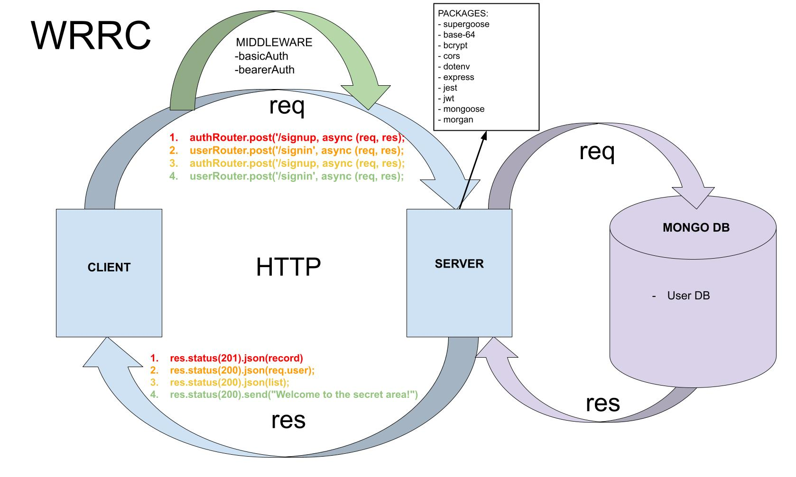

# Lab 07 - 401 JavaScript

# Bearer Auth

## Author: Mohammad Altamimi98

### Links and Resources


✨ [GitHub Actions](https://github.com/MohammadAltamimi98/bearer-auth/actions)

✨ [Pull Request](https://github.com/MohammadAltamimi98/bearer-auth/pull/2)

### Setup

- Clone down to your device
- In the root directory, run `npm install` to install node modules
- Run `nodemon` to see your live server via local host in your browser.

### Use

- You can create a new account via the /signup route, then sign into the route with the /signin route. Use [swagger.io](https://inspector.swagger.io/builder). 

```JS
{ "username": "TEST", "password": "TEST" }
```

### Test

In the command line at the root directory, `run npm test` to make sure all test are passing as expected.

Use [Code 401 JavaScript Assignment Runner](https://javascript-401.netlify.app/basic-auth)

### UML / WRRC



### Contributions 

Pair progammed with [Jason Taisey](https://github.com/JTaisey389)

### Sources

- [JWT Authentication Tutorial - Node.js](https://www.youtube.com/watch?v=mbsmsi7l3r4)
- [WebDevSimplified | JWT-Authentication](https://github.com/WebDevSimplified/JWT-Authentication)
